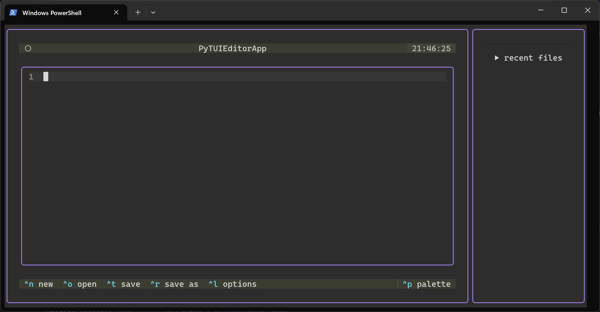

# PyTUI Editor
## Info

This is a `python` program which is a `textual` Terminal User Interface (TUI). It's a lightweight alternative to notepad.exe and a heavier alternative to lightning-text.exe (which uses **`rust`** and `ratatui` (amazing too)).

## Setup
This uses a simple pip3 venv, so

* fisrt run `git clone https://github.com/Arteposok/pytui_editor`
* then run `.\venv\Scripts\Activate`
* then `pip install -r requirements.txt`

and now, you can run `python main.py`.